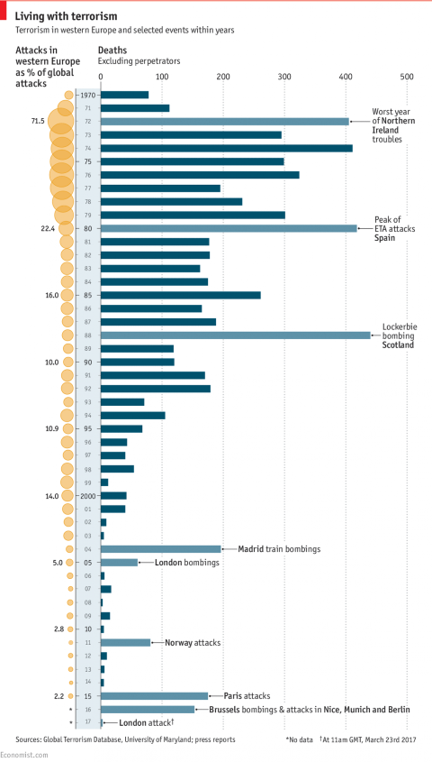

# Psychic Toxins

[TOC]

## Our information diet

Today we have come to understand that some our evolutionary mechanisms may lead us astray, in the altered conditions of modern life. For example, our innate predilection for foods that taste sweet made sense in an environment where such foods were hard to come by, and a valuable source of calories. But now that such foods are not only abundant but available in more concentrated forms than ever existed in nature, our sweet tooth, instead of having survival value, leads us to ill health. 

In a similar fashion, there are innate heuristics in the way we 'digest' news of dangerous happenings, and use it to evaluate risk. In the conditions that existed over most of our evolutionary history, people lived in small villages or groups and had little chance to know about anything that happened far away. In such a context, any distressing or problematic event you heard about (*a tiger ate my neighbor's child*, *the river has flooded and can no longer be forded at the usual place*..) almost certainly originated 'close to home' and had a direct impact upon you, requiring that you somehow act upon it. In other words, the type of news we evolved with consisted of local, functional information. 

And accordingly, it was evolutionarily useful for the emotional impact of such news to be high. Emotion (from the Latin *emovere*, to move or displace) is a spur to action, and if a tiger killed your neighbor's child some action on your part--defensive or preventive--is likely called for. It also made sense, in our evolutionary past, to have a 'taste' for this type of information, since it might alert us to potential risks that we should act upon. Because then information (like sugar) was scarce, and so just about anything you managed to find out would affect you directly. 

So this craving for emotionally impactful information evolved as a needing-to-know-information-I-have-to-act-upon. The more vivid the information--for example, accompanied by 'visuals' because you witnessed something with your own eyes, or told to you by someone through a striking first-person account--the stronger its emotional impact, because it meant the closer to home the event had occurred. Conversely, any news that reached you of more far away events--say, occurring in another settlement--would necessarily be less vivid, and less emotionally impactful. 

## Emotions with nowhere to go

But in modern conditions information--much like sugar--is abundant, and available in far more vivid, 'concentrated' forms than those we evolved to handle in an information-scarce environment. Media outlets exploit our innate craving for 'bad news', and the more vivid the better, just like food companies exploit our innate craving for sweet things. Only now there is no longer the same value in the news you might receive, because you can hear about a bunch of things that don't affect you directly, or at all. Also, the selection of things you hear about no longer reflects their real prevalence or importance, as it might have done in village life. 

For example, human-interest accounts of the victims of a terrorist attack have a high emotional impact--and this is why they are produced: like potato chips, because they 'sell'. But if we think about it, a media outlet could have decided to produce equally harrowing human-interest accounts of, say, the month's automobile accidents. There could be photographs, heart-rending interviews with maimed survivors and bereaved relatives... 

In fact, this might be more of a public service because--unlike terrorist attacks which, despite their extensive coverage and emotional impact, are exceedingly rare events--motor accidents are a very common risk that affects most of us directly. So there it might be worthwhile to work up our emotions to a higher pitch, and thereby spur us to take some preventive actions. 

Instead, with rare events like terrorist attacks, our wrought-up emotions have nowhere to go, we feel spurred to action yet there is not much action we can reasonably take. Often, we act anyway, but only in a way that makes things worse, like the 'hidden traffic fatalities' of September 11, among those who chose to drive rather than fly in the wake of the attack. Driving is vastly more dangerous than air travel, but it doesn't feel like it when you look at the news.

## Mindful consumption

So why don't news outlets and media companies choose to emphasize motor accidents rather than terrorist attacks, if that would be more useful? Well, the answer is that, just like Coca-Cola is not *meant* to provide a balanced mix of nutrients to your body, news and current events programs are not *meant* to provide a balanced or useful mix of information to their consumers. As Neil Postman points out in his 1985 book, *Amusing Ourselves to Death*, the mistake we make is not to recognize that these are *entertainment* programs.Their sole purpose is to attract viewers, listeners or clicks by pushing whatever psychological buttons it takes and exploiting our emotional responses, in the same way Coca-Cola exploits our innate sweet tooth to sell its product. 

This is true even for so-called 'public service' outlets, which are subject to the same pressures of attracting scarce attention, in the modern information landscape.   

But whereas with junk food we have reached some degree of awareness--that not everything a food company tries to sell to us is necessarily good for us, or what we want to consume--with information we are still naïve consumers. We think we can expose ourselves to all sorts of 'toxic' or 'junk' information and that this will not affect us in any way. We wouldn't do this with pesticides, or pollution, or additives--in fact, owing to internet scaremongering, many people even studiously avoid certain ingredients that have never been shown to cause any harm--yet we happily 'ingest' all kinds of garbage into our psyche, like kids drinking Kool-Aid in the 1970s. 

Just because something was packaged and put on a shelf doesn't mean it'll be good for you. We understand that about food, but when it comes to information we still operate from the assumption that whoever is putting the content together has our best interests at heart. 

The Buddhist monk  Thich Nhat Hanh, in his book *Anger*, says about mindful consumption:

> Because we are aware of the suffering caused by unmindful consumption, we make the commitment: To cultivate good health, both physical and mental, for myself, my family, and my society by practicing mindful eating, drinking and consuming.. Not to ingest food or other items that contain toxins such as certain TV programs, magazines, books, films and conversations...

## What's wrong with the world

Trashy content that panders to this natural 'thirst' for sensationalized information has always existed. But people forget that even what they think of as 'legitimate' news or current-events outlets are, more and more today, owing to the pressures of the internet, taking on the characteristics of entertainment, driven by whatever will 'hook' the information consumer, just like the soap operas of old.

 But the danger is that, whereas most people won't allow a soap opera to mould their view of 'how things are in the world', we do not similarly discount the entertainment content presented to us in the guise of 'news' or 'current events'. We forget that the 'items' presented to use were mostly selected on the basis of what would best titillate people's attention, and instead try to make sense of the world on the basis of them.

This leads us about as far astray as trying to concoct a healthy diet out of whatever food products are being most heavily advertised in a particular period. For example, when it comes to our perceptions of risk, security expert Bruce Schneier points out how commonplace hazards like motor accidents do not make the news because they happen all the time. On the other hand, striking, bizarre or even freakish events are highly newsworthy because of their novelty value. So really, Schneier goes on, you could almost say that, if something is reported in the news, then almost *by definition* you need not worry about it, because it is so unusual and unlikely.  It is vastly more likely that you will be impacted or harmed by the kinds of things that are not featured in news programs. 

In this refreshing light, one could think of the 'news' as a list of things not to worry about. 

For example, we all feel that we live today in an age of terrorism and danger that has never been so bad as it is now. But how much is this a true trend? And how much is it a perception, resulting from the fact that, thanks to the internet, these events are covered in a more thorough, vivid and insistent manner than ever before? 

Well, the below chart from the Economist shows that--as far as western Europe is concerned--the period from 2000 onward has been a remarkably quiet one, punctuated by some high profile events. It's hard to say now whether we are at the start of any worsening trend, it depends how the next few years pan out. But what is also interesting is how bad things were in the 1970s, '80s and even the '90s. Yet those decades, for many of the people old enough to recall them, are not associated with the same sense of menace that we feel today. 

## Self terrorism

Propagandists have known for a long time that information has a negative, as well as a positive value. You can destroy an enemy's morale by persuading him that things are going worse than they really are. The wartime motto "keep calm and carry on", so beloved of popular culture and meme-creators today, is really just an exhortation not to let yourself be terrorized--because that would just be playing the enemy's game. 

To the extent that terrorism is a 'warlike' action, it is mainly one with propaganda purposes. It is not the Blitz: the casualties inflicted thereby are negligible from the point of view of any armed struggle. (Of course, this is not to say that they are negligible for the persons involved, but in that sense all casualties are tragedies, including all the non-newsworthy ones.) So the only value of a terrorist attack is in its informational, propaganda content--in its ability to terrorize, to capture the emotions, and make people feel a threat out of all proportion to the reality. 

It is a mystery why we have decided to do this propagandizing on the enemy's behalf. Formerly, the enemy himself would have had to drop leaflets from an airplane, or issue radio broadcasts aimed at disheartening the population. Now it seems the market forces of our attention-based information economy, with its unfiltered stew of toxic, unrepresentative content--with no health warnings, ingredient lists, or nutritional guidelines on composing a balanced diet for the psyche--is doing this task of discouraging us on its own accord.

 

 
